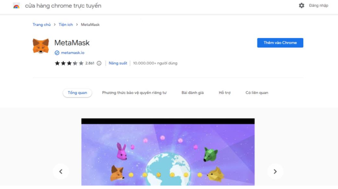

# CÁC BƯỚC KẾT NỐI VÍ METAMASK 
## Bước 1:
Thêm extension Metamask trong trình duyệt

  

## Bước 2: 
Tạo 1 ví mới. Tại đây cần phải làm các bước như tạo mật khẩu và xác thực an toàn cho ví
![alt] (/research/Connect Wallet/png/2.png)
## Bước 3: 
Sau khi tạo được mật khẩu ví thì sẽ thấy được giao diện ví của mình có các thông tin như địa chỉ ví, số dư,... Nó đang dùng mạng chính thức của ethereum và số coin đang có trong ví là 0 ETH. 
![alt] (/research/Connect Wallet/png/3.png)
## Bước 4:
Sử dụng REMIX IDE để kết nối ví như sau: 
![alt] (/research/Connect Wallet/png/4.png)
Sau khi kết nối, màn hình sẽ hiển thị địa chỉ ví:
![alt] (/research/Connect Wallet/png/5.png)
